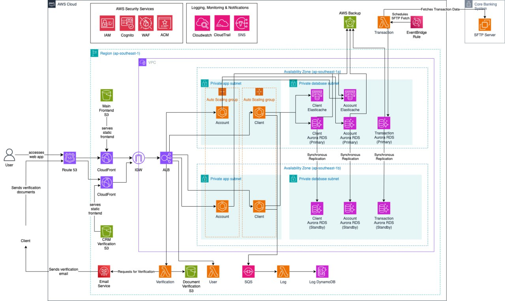

[](https://classroom.github.com/online_ide?assignment_repo_id=17700455&assignment_repo_type=AssignmentRepo)
# Scrooge Global Bank - Enterprise CRM System


> A cloud-native Customer Relationship Management (CRM) system for Scrooge Global Bank, developed as the final project for CS301 IT Systems Architecture.
>
> **🏆 Winner of the UBS SMU-X IT Solution Architecture Award 2024-25**

## 🚀 Key Technical Achievements

- **Cloud Architecture**: Designed and implemented a scalable AWS cloud architecture using microservices with ECS Fargate and AWS Lambda
- **Infrastructure as Code**: Provisioned entire infrastructure using Terraform, demonstrating DevOps and cloud engineering skills
- **Security Implementation**: Applied comprehensive security controls including OAuth 2.0, MFA, network segmentation, and DevSecOps practices
- **Scalability & Resilience**: Built multi-AZ deployments with auto-scaling capabilities that demonstrated handling 100+ concurrent requests
- **Compliance**: Implemented financial industry standards including MAS record-keeping guidelines
- **Full-Stack Development**: Developed responsive frontend with React/TypeScript and backend microservices in Java/Spring Boot

## 🏆 Awards & Recognition

This project was selected as the winner of the **UBS SMU-X IT Solution Architecture Award 2024-25**, recognizing it as the best solution among 18+ teams in the cohort. The award acknowledges excellence in enterprise architecture design, cloud implementation, and adherence to industry best practices.

## 🏗️ System Architecture



### Key Components

- **Frontend Layer**: React SPA with Material UI, deployed to S3 and CloudFront
- **Authentication**: AWS Cognito with OAuth 2.0 and MFA integration
- **Core Microservices**: 
  - Client Management (ECS Fargate)
  - Account Services (ECS Fargate)  
  - Transaction Processing (Lambda)
  - Verification Service (Lambda)
  - Logging (Lambda + DynamoDB)
- **Data Layer**: Aurora PostgreSQL for transactional data, DynamoDB for logs, ElastiCache for performance
- **Infrastructure**: Multi-AZ deployment with auto-scaling and load balancing

## 💻 Tech Stack

### Cloud & DevOps
- AWS (ECS, Lambda, Aurora RDS, Cognito, S3, CloudFront, ElastiCache, DynamoDB)
- Terraform for Infrastructure as Code
- GitHub Actions for CI/CD pipelines
- Docker containerization

### Backend
- Microservices architecture
- Java/Spring Boot
- RESTful API design
- Event-driven architecture with SQS

### Frontend
- React.js with TypeScript
- Material UI
- Responsive design principles

### Security & Performance
- OAuth 2.0 with MFA
- Network security with VPC design
- OWASP security standards
- Performance optimization with caching and read replicas

## 📋 Project Implementation

### Development Process
- Applied agile methodologies with sprint planning and retrospectives
- Utilized trunk-based development for version control
- Implemented Infrastructure as Code with Terraform for reproducible deployments
- Performed load testing to validate scalability requirements

## 🔍 Technical Deep Dive

### Architecture Decisions
- **PostgreSQL for Transaction Data**: Selected for ACID compliance and enterprise-level concurrency control
- **DynamoDB for Logging**: Optimized for high-volume write operations with flexible schema
- **Multi-AZ Deployment**: Implemented for high availability and disaster recovery
- **Serverless Functions**: Used Lambda for event-driven workloads to optimize costs
- **Containerized Microservices**: Deployed core services on ECS for scalability and isolation

### Performance Metrics
- Successfully processed 100+ concurrent user requests with sub-500ms response times
- Implemented auto-scaling to handle peak loads
- Achieved 99.95% availability in stress test scenarios

## 🚦 Getting Started

### Prerequisites
- AWS Account
- Terraform 1.0+
- Node.js 18+
- Java 21
- Docker

### Configuration Files
Several configuration files are not tracked in Git for security reasons. You'll need to create these before deployment:

#### Terraform Variables
Create a `terraform.tfvars` file in the `terraform/` directory with the following variables:
```
DATABASE_USERNAME="<your-db-username>"
DATABASE_PASSWORD="<your-strong-password>"
DATABASE_NAME="<your-db-name>"
DOMAIN_NAME="<your-domain-name>"
ROUTE53_ZONE_ID="<your-route53-zone-id>"
COGNITO_DOMAIN="<your-cognito-domain-prefix>"
mfa_configuration="ON"
```

#### Frontend Environment
Create the following files in the `frontend/` directory:

1. `.env` file for development:
```
VITE_API_ENDPOINT=http://localhost:8080
VITE_COGNITO_USER_POOL_ID=<your-user-pool-id>
VITE_COGNITO_CLIENT_ID=<your-app-client-id>
VITE_COGNITO_DOMAIN=<your-auth-domain>
```

2. `.env.production` file for production:
```
VITE_API_ENDPOINT=https://<your-api-endpoint>
VITE_COGNITO_USER_POOL_ID=<your-user-pool-id>
VITE_COGNITO_CLIENT_ID=<your-app-client-id>
VITE_COGNITO_DOMAIN=<your-auth-domain>
```

#### Backend Service Configuration
Each microservice in the `backend/` directory requires configuration in `src/main/resources/application.properties`:

1. Example for Client service:
```properties
spring.datasource.url=jdbc:postgresql://${DB_HOST}:5432/${DB_NAME}
spring.datasource.username=${DB_USER}
spring.datasource.password=${DB_PASSWORD}
aws.region=${AWS_REGION}
aws.cognito.jwk=${COGNITO_JWK_URL}
aws.sqs.log-queue-url=${LOG_QUEUE_URL}
```

### Local Development
```bash
# Frontend
cd frontend
npm install
npm run dev

# Backend services
cd backend/[service-name]
./mvnw spring-boot:run
```

### Deployment
```bash
# Initialize Terraform
cd terraform
terraform init

# Plan and review changes
terraform plan -var-file=terraform.tfvars

# Apply infrastructure changes
terraform apply -var-file=terraform.tfvars
```

## 👥 Team

This project was completed by CS301-G2T1:

- [HO MIN HAN](https://github.com/saplingonfire)
- [JOEL LIM JING KAI](https://github.com/LimJingKaiJoel)
- [KAUNG SET LIN](https://github.com/setl1n)
- [VINCE TAN YUEH YANG](https://github.com/vincetyy)
- [WU YEKAI](https://github.com/yekaiwu)
- [YEW YING XUAN](https://github.com/xuan2103)
- [ZANE CHEE JUN YI](https://github.com/injaneity)

---

This project was completed as part of CS301 IT Systems Architecture at Singapore Management University. The implementation reflects real-world enterprise architecture principles and modern cloud development practices.
